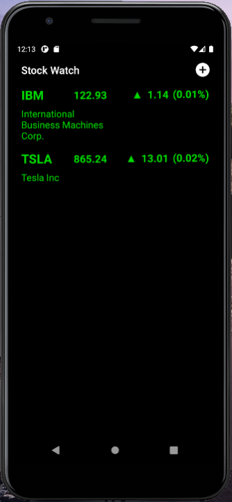
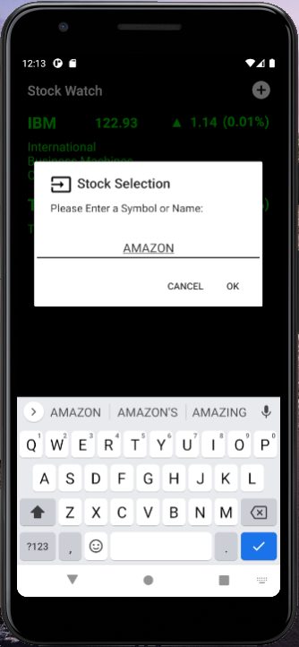
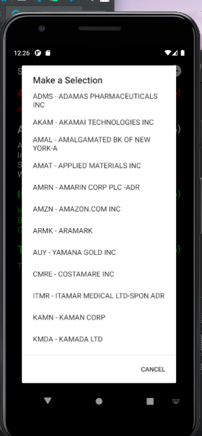
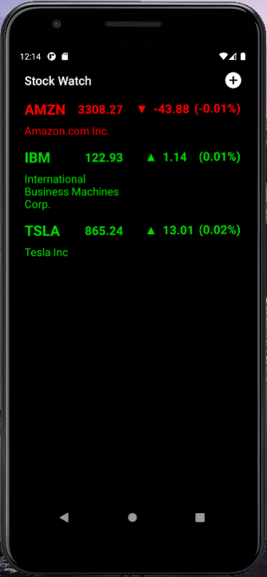
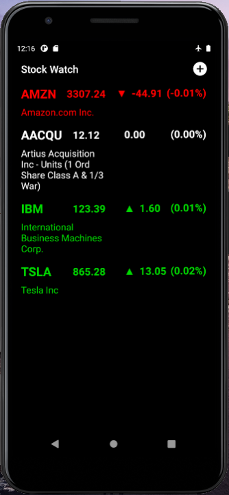
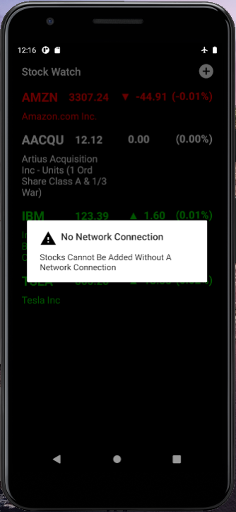
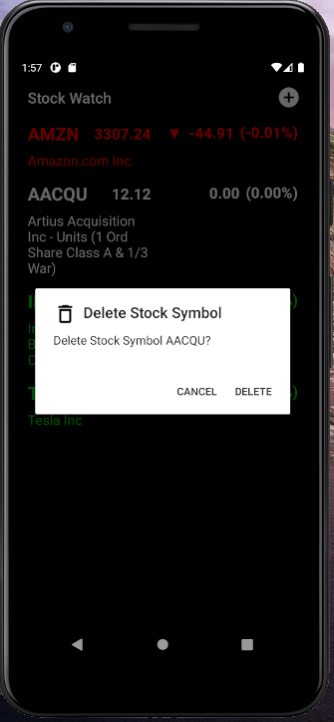

# Stock Watch

Stock watching app developed in Android Studio using Java

**Application Design**

The application is displaying desired stocks in main activity.

Selecting a plus icon in the upper right corner will show input dialog used to enter stock/company names

Accepting the input will display a list if the company name does not immediatelly matches and if it does it will display stock result to main activity

 

If the stock does not have any changes, it will be displayed in white font, if the change is negative red and if the change is positive green.

If there is no network connection, the message will show up in a dialog box.

Deleting a stock is done by long press that displays dialog box.

Clicking on a stock will open external browser and take the user to MarketWatch website for detailed info.

To refresh stock prices and use swipe refresh swipe down.  
